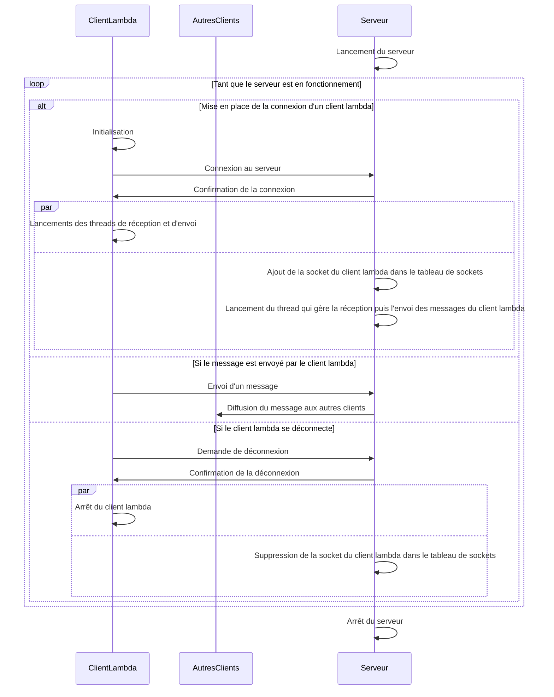

# Livrable du sprint 1

## Table des matières

- [Arborecense du sprint](#arborecense-du-sprint)
  - [Partie 1](#partie-1)
  - [Partie 2](#partie-2)
  - [Partie 3](#partie-3)
- [Description du sujet (v2 uniquement)](#description-du-sujet-v2-uniquement)
  - [Au global](#au-global)
  - [Au niveau du serveur](#au-niveau-du-serveur)
  - [Au niveau du client](#au-niveau-du-client)
- [Protocole de communication (v2 uniquement)](#protocole-de-communication-v2-uniquement)
  - [Explication du diagramme de séquence](#explication-du-diagramme-de-séquence)
  - [Extrait de la documentation de mermaid](#extrait-de-la-documentation-de-mermaid)
    - [Loop](#loop)
    - [Alt](#alt)
    - [Par](#par)
  - [Rappel](#rappel)
  - [Diagramme de séquence](#diagramme-de-séquence)
- [Difficultés rencontrées](#difficultés-rencontrées)
- [Répartition du travail](#répartition-du-travail)
- [Compilation et exécution](#compilation-et-exécution)
  - [Tips](#tips)
  - [Partie 1](#partie-1-1)
  - [Partie 2](#partie-2-1)
  - [Partie 3](#partie-3-1)

## Arborecense du sprint

Pour nous organiser nous avons séparé le projet en 3 parties qui sont séparées dans des fichiers différents.

### Partie 1

Sujet de la séance 1: un serveur relaie des messages textuels entre deux clients.

### Partie 2

Sujet de la séance 2, 3 et 4 (v1): utiliser le multi-threading pour gérer l’envoi de messages dans n’importe quel ordre.

### Partie 3

Sujet de la séance 2, 3 et 4 (v2): mise en place d’un serveur qui puisse gérer n clients.

## Description du sujet (v2 uniquement)

Nous avons décidé d'expliciter la version 2 du sujet pour mieux comprendre le fonctionnement du programme le plus abouti de ce sprint.

### Au global
Mise en place d’un serveur qui puisse gérer n clients, pour cela mettre en place un tableau partagé pour stocker leurs identifiants sockets, par défaut, les messages arrivant depuis un client sont relayés à tous les autres présents.

### Au niveau du serveur
1 thread par client pour écouter les messages qui proviennent du client et les diffuser vers tous les autres clients. 

### Au niveau du client
1 processus pour la saisie (avec fgets) et l’envoi du message au serveur et 1 autre processus pour la réception des messages du serveur et leur affichage (avec puts) soit le programme principal plus un thread minimum.

## Protocole de communication (v2 uniquement)

### Explication du diagramme de séquence

Le diagramme de séquence ci-dessous explique le fonctionnement du serveur et des clients.

Voici les 3 propriétés pour comprendre le diagramme de séquence:

                (Ici x et ClientLambda sont des éléments, Clients et AutresClients sont des ensembles)

                ∀ x ∈ Client, x est un ClientLambda

                Clients = {ClientLambda} ∪ AutresClients

                0 <= |Clients| <= 10 (nombre de clients maximum dans la variable globale)

### Extrait de la documentation de mermaid

#### Loop

        It is possible to express loops in a sequence diagram. This is done by the notation

        loop Loop text
        ... statements ...
        end

#### Alt

        It is possible to express alternative paths in a sequence diagram. This is done by the notation

        alt Describing text
        ... statements ...
        else
        ... statements ...
        end
        
        or if there is sequence that is optional (if without else).

        opt Describing text
        ... statements ...
        end

#### Par

        It is possible to show actions that are happening in parallel. This is done by the notation

        par [Action 1]
        ... statements ...
        and [Action 2]
        ... statements ...
        and [Action N]
        ... statements ...
        end

### Rappel

Pour afficher les différents diagrammes de séquence, il faut installer l'extension mermaid pour visual studio code. Si vous vous trouvez sur github, affichage est directement géré par celui-ci.

### Diagramme de séquence

## Difficultés rencontrées

Pour la v2, nous avons rencontré des difficultés par rapport à la gestion de déconnexion des clients. Lors de tests poussés nous avons remarqué des problèmes lors de l'envoi de messages: alors qu'un client s'était déconnecté des comportements inattendus se produisaient. Nous avons donc décidé de mettre en place la gestion de déconnexion des clients (bien que ce ne soit pas obligatoire pour ce sprint). Nous avons donc mis en place un tableau de socket qui contient les sockets des clients connectés, lors de l'initialisation les valeurs étaient de -1. Lorsqu'un client se connecte, nous ajoutons sa socket dans le tableau et lorsqu'il se déconnecte nous mettons -1 à la place de sa socket. Nous avons donc pu gérer les connexions et déconnexions des clients comme ceci.

## Répartition du travail

Tout d'abord avant de coder, nous avons décidé en amont comment chaque étape clé devrait être traitée pour donner des indications claires à chacun de nous. Puis la répartition du travail s'est faite de manière à pouvoir travailler continuellement sur un même aspect du projet et à pouvoir respecter les délais imposés. Lorsque Léon travaille sur la partie serveur, Wayne travaille en parallèle sur la partie client pour une meilleure efficacité et rapidité. Bien sûr après chaque étape, il faut réunir les résultats et s'assurer que les concepts et les méthodes utilisées sont corrects. Il a été important de travailler au même moment l'un a côté de l'autre en cas de blocage et d'incertitude sur la manière de procéder. Enfin, nous avons fait ensemble les différents tests et nous avons pu ainsi nous assurer que le projet fonctionne correctement.

## Compilation et exécution

Le compilateur `gcc` est requis pour compiler le code. Pour compiler et exécuter le code, il suffit de se situer au bon endroit dans le fichier du SPRINT1. Chaque partie (1, 2 et 3) est localisée dans son fichier. Pour lancer le programme, voici les commandes et les tips pour exécuter correctement le programme:

### Tips

1. Port du serveur doit être supérieur à 1024 pour éviter certains problèmes

2. Pour lancer le serveur, il faut utiliser un autre port pour chaque lancement de serveur car cela peut créer des problèmes

3. Pour lancer les clients, il faut que le port du client et du serveur soit le même

4. Pour lancer le client, il faut que le serveur soit lancé avant le client

5. En local, l'adresse IP du serveur est 127.0.0.1

6. Possibilité de changer certaines valeurs comme le nombre de clients maximum, le nombre de caractères maximum par message, etc ...

### Partie 1

1. D'abord compiler le fichier serveur pour avoir un fichier C compilable: 
        
        gcc -Wall -o serveur serveur.c

2. Ensuite lancer le serveur: 
        
        ./serveur <port du serveur choisi>  

3. Puis compiler le fichier client: 

        gcc -Wall -o client client.c

4. Enfin pour lancer le client: 

        ./client <adresse IP du serveur> <port du serveur>
  
### Partie 2

1. D'abord compiler le fichier serveur pour avoir un fichier C compilable: 

        gcc -Wall -o serveur serveur.c

2. Ensuite lancer le serveur: 

        ./serveur <port du serveur choisi>
    
3. Puis compiler le fichier client: 

        gcc -Wall -o client client.c

4. Et lancer le client1:

        ./client <adresse IP du serveur> <port du serveur> 1
    
5. Enfin lancer le Client2:

        ./client <adresse IP du serveur> <port du serveur> 2
  
### Partie 3

1. D'abord compiler le fichier serveur pour avoir un fichier C compilable: 

        gcc -Wall -o serveur serveur.c

2. Ensuite lancer le serveur: 

        ./serveur <port du serveur choisi>

3. Puis compiler le fichier client: 

        gcc -Wall -o client client.c

4. Enfin lancer pour chaque client: 

        ./client <adresse IP du serveur> <port du serveur>

    NB: chaque client sera identifié sur le serveur automatiquement
    
    NB: le serveur peut gérer jusqu'à 10 clients pour le modifier, il faut modifier la valeur de la variable MAX_CLIENTS dans le fichier serveur.c

