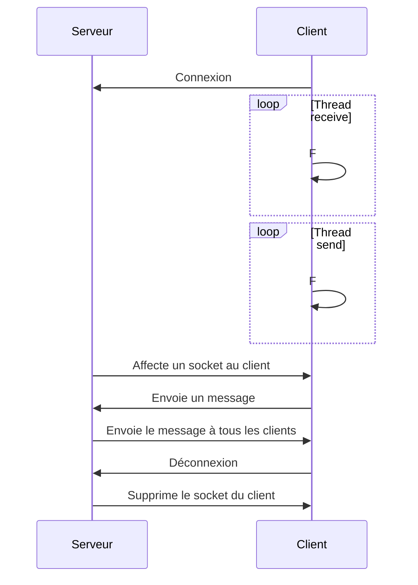

# Livrable du sprint 1

## Description du sujet (v2 uniquement)

### Au global
Mise en place d’un serveur qui puisse gérer n clients, pour cela mettre en place un tableau partagé pour stocker leurs identifiants sockets, par défaut, les messages arrivant depuis un client sont relayés à tous les autres présents.

### Au niveau du serveur
1 thread par client pour écouter les messages qui proviennent du client et les diffuser vers tous les autres clients. 

### Au niveau du client
1 processus pour la saisie (avec fgets) et l’envoi du message au serveur et 1 autre processus pour la réception des messages du serveur et leur affichage (avec puts) soit le programme principal plus un thread minimum.

## Protocole de communication (v2 uniquement)

## Description de l’architecture

## Difficultés rencontrées

Pour la v2, nous avons rencontré des difficultés par rapport à la gestion de déconnexion des clients. Lors de test poussé nous avons remarqué des problèmes lors de l'envoi de message: alors qu'un client s'était déconnecté des comportements inattendus se produisaient. Nous avons donc décidé de mettre en place la gestion de déconnexion des clients (bien que ce ne soit pas obligatoire pour ce sprint). Nous avons donc mis en place un tableau de socket qui contient les sockets des clients connectés, lors de l'initialisation les valeurs étaient de -1. Lorsqu'un client se connecte, nous ajoutons sa socket dans le tableau et lorsqu'il se déconnecte nous mettons -1 à la place de sa socket. Nous avons donc pu gérer les connextions et déconnexions des clients comme ceci.

## Répartition du travail

Tout d'abord avant de coder, nous avons décidé en amont comment chaque étapes clé devrait être traitées pour donner des indications claires à chacun de nous.

Puis la répartition du travail s'est faite de manière à pouvoir travailler continuellement sur un même aspect du projet et à pouvoir respecter les délais imposés. Lorsque Léon travaille sur la partie serveur, Wayne travaille en parallèle sur la partie client pour une meilleure efficacité et rapidité. Bien sûr après chaque étape, il faut réunir les résultats et s'assurer que les concepts et les méthodes utilisées sont correctes. Un point de vue critique est alors apporté au moment où Wayne revoit la partie du serveur, et Léon revoit la partie du client.

Il a été important de travailler au même moment l'un a coté de l'autre en cas de blocage et d'incertitude sur la manière de procéder. 

Pour nous organiser nous avons séparé le projet en 3 parties qui sont séparés dans le fichier SPRINT1. 

### Partie 1
Sujet de la séance 1: Un serveur relaie des messages textuels entre deux clients

### Partie 2
Sujet de la séance 2 (v1): Utiliser le multi-threading pour gérer l’envoi de messages dans n’importe quel ordre.

### Partie 3
Sujet de la séance 2: (v2): Mise en place d’un serveur qui puisse gérer n clients

Les détails du procédé de la partie finale est détaillé dans le fichier principal du sprint où un README est disponible. 

## Compilation et exécution

Pour compiler et exécuter le code, il suffit de se situer au bon endroit dans le fichier du SPRINT1. Chaque partie (1, 2 et 3) est localisé dans son fichier. 

### Tips

1. Port du serveur doit être supérieur à 1024 pour éviter certains problèmes

2. Pour lancer le serveur, il faut utiliser un autre port pour chaque lancement de serveur car cela peut créer des problèmes

3. Pour lancer les clients, il faut que le port du client et du serveur soient le même

4. Pour lancer le client, il faut que le serveur soit lancé avant le client

5. En local, l'adresse IP du serveur est 127.0.0.1

6. Possibilité de changer certaines valeurs comme le nombre de clients maximum, le nombre de caractères maximum par message, etc ...

Pour lancer le programme, voici les commandes à effectuer dans un terminal:

### Partie 1
1. D'abord compiler le fichier serveur pour avoir un fichier C compilable: 
        
        gcc -Wall -o serveur serveur.c
2. Ensuite lancer le serveur: 
        
        ./serveur <port du serveur choisi>  

3. Puis compiler le fichier client: 

        gcc -Wall -o client client.c

4. Enfin pour lancer le client: 

        ./client <adresse IP du serveur> <port du serveur>
  
### Partie 2
1. D'abord compiler le fichier serveur pour avoir un fichier C compilable: 

        gcc -Wall -o serveur serveur.c

2. Ensuite lancer le serveur: 

        ./serveur <port du serveur choisi>
    
3. Puis compiler le fichier client: 

        gcc -Wall -o client client.c

4. Et lancer le client1:

        ./client <adresse IP du serveur> <port du serveur> 1
    
5. Enfin lancer le client2:

        ./client <adresse IP du serveur> <port du serveur> 2
  
### Partie 3
1. D'abord compiler le fichier serveur pour avoir un fichier C compilable: 

        gcc -Wall -o serveur serveur.c

2. Ensuite lancer le serveur: 

        ./serveur <port du serveur choisi>

3. Puis compiler le fichier client: 

        gcc -Wall -o client client.c

4. Enfin lancer pour chaque client: 

        ./client <adresse IP du serveur> <port du serveur> 
    NB: chaque client sera identifié sur le serveur automatiquement
    
    NB: le serveur peut gérer jusqu'à 10 clients pour le modifier, il faut modifier la valeur de la variable MAX_CLIENTS dans le fichier serveur.c

