# Livrable du sprint 2

## Table des matières

**1. [Description du projet](#description-du-projet)**

  1.1. [commandes.txt](#commandestxt)

  1.2. [commandes.c et commandes.h](#commandesc-et-commandesh)

  1.3. [global.c et global.h](#globalc-et-globalh)
  
  1.4. [client.c](#clientc)

  1.5. [serveur.c](#serveurc)

**2. [Protocole de communication](#protocole-de-communication)**
  
  2.1. [Explication du diagramme de séquence](#explication-du-diagramme-de-séquence)
  
  2.2. [Extrait de la documentation de mermaid](#extrait-de-la-documentation-de-mermaid)
    
  - [Loop](#loop)
  - [Alt](#alt)
  - [Par](#par)

  2.3. [Rappel](#rappel)
  
  2.4. [Diagramme de séquence](#diagramme-de-séquence)

**3. [Difficultés rencontrées](#difficultés-rencontrées)**

**4. [Répartition du travail](#répartition-du-travail)**

**5. [Compilation et exécution](#compilation-et-exécution)**

  5.1. [Tips](#tips)

  5.2. [Commandes](#commandes)

## Description du projet

### **`commandes.txt`**

Tout d'abord il y a le fichier **`commandes.txt`** qui contient toutes les commandes que l'on peut utiliser dans le programme et qui est utilisé pour la commande help.

### **`commandes.c`** et **`commandes.h`**

Pour nous organiser nous avons détaché la partie commande du projet dans un fichier différent qui s'appelle **`commandes.c`** et **`commandes.h`**.
Ils contiennent les différentes commandes explicitées dans le fichier **`commandes.txt`**.
Cela permet de mieux organiser le code et de mieux comprendre le fonctionnement du programme et que le fichier **`serveur.c`** soit plus compact.

### **`global.c`** et **`global.h`**

Les variables globales sont dans le fichier **`global.c`** et **`global.h`**.
Il y a des variables/constantes qui sont utilisées dans **`client.c`**, **`serveur.c`** et **`commandes.c`** ou que dans **`serveur.c`** et **`commandes.c`**. 
Cela permet de modifier qu'une seule fois une variable globale si on veut changer sa valeur.

### **`client.c`**

Ce fichier n'a presque pas changé depuis le sprint 1. Il contient le code du client. Nous avons modifié quelques parties du code comment l'ajout de la gestion des signaux pour le **`CTRL + C`** ou la modification de l'affichage des messages.

### **`serveur.c`**

Il a été modifié pour gérer tout le protocole de communication.
L'ajout de sémaphores pour gérer le nombre de places disponibles dans le serveur et gérer les threads à nettoyer.
Ajout d'un thread pour gérer le nettoyage des threads.
Ajout d'un mutex pour gérer l'accès aux variables globales (Nous avons décidé qu'un seul mutex suffisait pour gérer l'accès à toutes variables globales puisqu'ils sont tous étroitement liées).
D'ailleurs, le mutex ou les sémaphores sont surtout utilisés au niveau du fichier **`commandes.c`**, seuls quelques cas comme l'initialisation ou autres sont sur le fichier **`serveur.c`**.
L'ajout de la gestion des signaux pour le `CTRL + C` ou la modification de l'affichage des messages ont été ajouté.

## Protocole de communication

### Explication du diagramme de séquence

Le diagramme de séquence ci-dessous explique le fonctionnement du serveur et des clients.

Voici les 3 propriétés pour comprendre le diagramme de séquence:

                (Ici x et ClientLambda sont des éléments, Clients et AutresClients sont des ensembles)

                ∀ x ∈ Client, x est un ClientLambda

                Clients = {ClientLambda} ∪ AutresClients

                0 <= |Clients| <= 10 (nombre de clients maximum dans la variable globale)

### Extrait de la documentation de mermaid

#### Loop

        It is possible to express loops in a sequence diagram. This is done by the notation

        loop Loop text
        ... statements ...
        end

#### Alt

        It is possible to express alternative paths in a sequence diagram. This is done by the notation

        alt Describing text
        ... statements ...
        else
        ... statements ...
        end
        
        or if there is sequence that is optional (if without else).

        opt Describing text
        ... statements ...
        end

#### Par

        It is possible to show actions that are happening in parallel. This is done by the notation

        par [Action 1]
        ... statements ...
        and [Action 2]
        ... statements ...
        and [Action N]
        ... statements ...
        end

### Rappel

Pour afficher les différents diagrammes de séquence, **il faut installer l'extension mermaid pour visual studio code**. Si vous vous trouvez sur github, affichage est directement géré par celui-ci.

## Diagramme de séquence

```mermaid
sequenceDiagram
        participant Serveur
        box L'ensemble des clients
                participant ClientLambda
                participant AutresClients
        end
        
        activate Serveur
        Serveur->>Serveur: Initialisation des différentes variables, mutex, sémaphores, mémoire partagée
        Serveur->>Serveur: Semaphores pour le nombre de connexion
        Serveur->>Serveur: Lancement du serveur
        Serveur->>Serveur: Lancement du thread qui gère le nettoyage des threads
        
        loop Tant que le serveur est en fonctionnement

                activate ClientLambda
                ClientLambda->>ClientLambda: Initialisation
                ClientLambda->>Serveur: Connexion au serveur

                par Mise en place de la connexion d'un client lambda
                        ClientLambda->>ClientLambda: Lancements des threads de réception et d'envoi
                        Serveur-->>ClientLambda: Demande de pseudo
                        ClientLambda->>Serveur: Envoi du pseudo
                        Serveur->>Serveur: Mise à jour du pseudo
                        Serveur-->>ClientLambda: Message de bienvenue
                and
                        Serveur->>Serveur: Mise à jour du tableau de sockets
                        Serveur->>Serveur: Lancement du thread qui gère la réception et l'envoi des messages du client lambda
                end

                ClientLambda->>Serveur: Envoi d'un message
                Serveur->>Serveur: Vérification du message
                activate AutresClients

                alt Si le message est une commande
                        
                        Serveur->>Serveur: Découpage du message en token
                        Serveur->>Serveur: Vérification de la commande
                        Serveur->>Serveur: Exécution de la commande
                        
                        
                        alt Si la commande est un sudo mp
                                Serveur->>Serveur: Vérification de l'existence du destinataire
                                Serveur-->>AutresClients: Envoi du message au destinataire
                        else Si la commande est un sudo all
                                Serveur-->>AutresClients: Diffusion du message aux autres clients (broadcast)
                        else Si la commande est un sudo help ou sudo list
                                Serveur-->>ClientLambda: Envoi de la liste des commandes ou des clients connectés
                        else Si la commande est un sudo kick ou sudo quit
                                Serveur->>Serveur: Vérification de l'existence du destinataire
                                alt Si la commande est un sudo kick
                                        Serveur->>Serveur: Vérification de l'existence de expéditeur
                                        Serveur-->>ClientLambda: Préviens le destinataire qu'il va être déconnecté
                                else Si la commande est un sudo quit (ou le programme client se ferme à l'aide de ctrl+c)
                                        Serveur-->>ClientLambda: Préviens le destinataire qu'il va être déconnecté
                                end
                                Serveur->>Serveur: Suppression de la connexion du destinataire
                                Serveur->>Serveur: Ajout d'un jeton dans le sémaphore qui gère le nombre de connexion
                                Serveur->>Serveur: Nettoyage du thread du destinataire dans la mémoire partagée
                        end

                else Si le message est un message normal
                        Serveur-->>AutresClients: Diffusion du message aux autres clients (broadcast)
                end

                deactivate AutresClients

        end

        Serveur->>Serveur: Deconnexion des clients
        ClientLambda-->>ClientLambda: Déclenchement un message de fermeture de connexion
        deactivate ClientLambda
        Serveur-->>Serveur: Fermeture du serveur
        deactivate Serveur

```

## Difficultés rencontrées

Nous avons rencontré des difficultés par rapport au découpage des commandes en token: seul le premier mot entré été renvoyé au destinataire pour la commande message privé. 
Ceci a vite été résolu en revoyant le code.
Puis nous avons eu quelques difficultés pour les commandes "sudo quit" et "sudo kick" pour la fermeture de manière propre de la connexion client et que côté client, il gère cette fermeture.
Enfin nous avons surtout eu des difficultés pour comprendre comment, pourquoi et dans quel cas il fallait employer les mutex, sémaphores et mémoires partagée.
Nous avons donc dû faire des recherches et des tests pour comprendre comment les utiliser et les implémenter dans notre code.
Par exemple les mutex nous avons fait le choix dans un premier temps de l'utiliser que pour l'écriture des variables partagées.
Puis nous avons décidé de l'utiliser aussi pour la lecture des variables partagées, fallait-il en faire pour chaque variable partagée ou un seul pour tous, etc ...
Enfin nous avons eu des difficultés pour la fermeture des threads avec la mémoire partagée, car nous avons dû faire des tests pour comprendre comment cela fonctionnait et comment l'implémenter dans notre code.

## Répartition du travail

Tout d'abord avant de coder, nous avons décidé en amont comment chaque étape clé devrait être traitée pour donner des indications claires à chacun de nous.
Vu que le travail en parallèle a bien fonctionné le dernier sprint, nous sommes restés sur la même optique.
Puis la répartition du travail s'est faite de manière à pouvoir travailler continuellement sur un même aspect du projet et à pouvoir respecter les délais imposés.
Pour ce sprint, nous avons déterminé que la partie client ne nécessitait pas de grands changements, donc nous avons tous les deux travaillé sur la partie serveur.
Après s'être mis d'accord sur les commandes utilisables (voir fichier commandes.txt), Léon s'est occupé de la réorganisation des fichiers, implémentation de mutex, sémaphores, synchronisations des threads.
En parallèle, Wayne s'est occupé de la gestion des signaux et des commandes: détection, découpage en token et implémentation des fonctions. Il a été important de travailler au même moment l'un a côté de l'autre en cas de blocage et d'incertitude sur la manière de procéder.
Cependant, ce sprint étant plus long et avec l'impossibilité de se voir pendant les vacances scolaires, la fin de ce sprint par appel vocal sur discord.
Enfin, nous avons fait des tests chacun de notre côté pour les améliorations possibles.

## Compilation et exécution

### Tips

1. Port du serveur doit être supérieur à 1024 pour éviter certains problèmes

2. Pour lancer le serveur, il faut utiliser un autre port pour chaque lancement de serveur car cela peut créer des problèmes

3. Pour lancer les clients, il faut que le port du client et du serveur soit le même

4. Pour lancer le client, il faut que le serveur soit lancé avant le client

5. En local, l'adresse IP du serveur est 127.0.0.1

6. Possibilité de changer certaines valeurs comme le nombre de clients maximum, le nombre de caractères maximum par message, etc ...

### Commandes

1. D'abord compiler le fichier serveur pour avoir un fichier C compilable: 
        
        gcc global.c commandes.c serveur.c -Wall -o serveur

2. Ensuite lancer le serveur: 
        
        ./serveur <port du serveur choisi>  

3. Puis compiler le fichier client: 

        gcc global.c client.c -Wall -o client

4. Enfin pour lancer le client: 

        ./client <adresse IP du serveur> <port du serveur>
