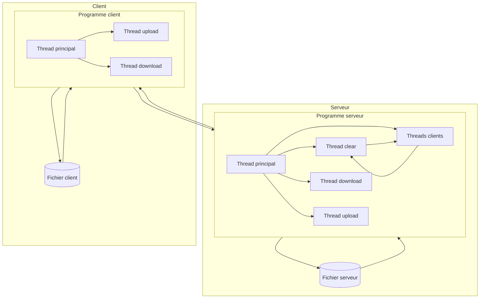

# Livrable du sprint 3

## Table des matières

**1. [Description du projet](#description-du-projet)**

  1.1. [commandes.txt](#commandestxt)

  1.2. [commandes.c et commandes.h](#commandesc-et-commandesh)

  1.3. [global.c et global.h](#globalc-et-globalh)
  
  1.4. [client.c](#clientc)

  1.5. [serveur.c](#serveurc)

  1.6. [transferServer et transferClient](#transferserver-et-transferclient)

**2. [Protocole de communication](#protocole-de-communication)**
  
  2.1 [Architecture du projet](#architecture-du-projet)

  2.2. [Explication du diagramme de séquence](#explication-du-diagramme-de-séquence)
  
  2.3. [Extrait de la documentation de mermaid](#extrait-de-la-documentation-de-mermaid)
    
  - [Loop](#loop)
  - [Alt](#alt)
  - [Par](#par)

  2.4. [Rappel](#rappel)
  
  2.5. [Diagramme de séquence](#diagramme-de-séquence)

**3. [Difficultés rencontrées](#difficultés-rencontrées)**

**4. [Répartition du travail](#répartition-du-travail)**

**5. [Compilation et exécution](#compilation-et-exécution)**

  5.1. [Tips](#tips)

  5.2. [Commandes](#commandes)

## Description du projet

### **`commandes.txt`**

Tout d'abord il y a le fichier **`commandes.txt`** qui contient toutes les commandes que l'on peut utiliser dans le programme et qui est utilisé pour la commande help.

### **`commandes.c`** et **`commandes.h`**

Pour nous organiser nous avons détaché la partie commande du projet dans un fichier différent qui s'appelle **`commandes.c`** et **`commandes.h`**.
Ils contiennent les différentes commandes explicitées dans le fichier **`commandes.txt`**.
Cela permet de mieux organiser le code et de mieux comprendre le fonctionnement du programme et que le fichier **`serveur.c`** soit plus compact.

### **`global.c`** et **`global.h`**

Les variables globales sont dans le fichier **`global.c`** et **`global.h`**.
Il y a des variables/constantes qui sont utilisées dans **`client.c`**, **`serveur.c`** et **`commandes.c`** ou que dans **`serveur.c`** et **`commandes.c`**. 
Cela permet de modifier qu'une seule fois une variable globale si on veut changer sa valeur ou cela permet d'avoir des fonctions en commun entre **`client.c`** et **`serveur.c`** comme la fonction **`fileExist()`**.

### **`client.c`**

Ce fichier contient le code du client. Nous avons ajouté les fonctions, les threads pour l'envoi et la récupération de fichier. Ces commandes nécéssitent l'ouverture de 2 nouveaux ports pour le download et upload de fichiers. Par conséquent lorsque un client download ou upload un fichier, il ouvre une nouvelle socket, connection et port associé à cette action dans un thread ce qui permet de continuer à utiliser le client et de ne pas bloquer le client puis la connection ce ferme une fois l'action terminée.

### **`serveur.c`**

Ce fichier contient le code du serveur.
Nous avons ajouté les fonctions, les threads pour l'envoi et la récupération de fichier. Ils sont sensiblement les mêmes que ceux du client mais inversés. Lorsque le serveur démarre il écoute sur 2 nouveaux ports qui sont les 2 suivantes du port classique du serveur qui est passé en paramètre.

### **`transferServer`** et **`transferClient`**

Ce sont des dossier qui contiennent les fichiers qui sont envoyés et reçus par le serveur et le client. Dans la réalité, ils seraient dans un dossier différent car le serveur et le client ne sont pas sur la même machine d'ailleurs il y aurait plusieurs clients avec donc plusieurs dossiers différents de **`transferClient`**. C'est pour cela que lorsque le client download un fichier, il est download pour tous les clients puisque tous les clients sont sur le même dossier.

Nous avons ajouté quelques fichiers d'exemple dans **`transferServer`** et dans **`transferClient`**.

## Protocole de communication

Le diagramme de l'architecture ci-dessous explique le fonctionnement du serveur et des clients, avant de rentrer dans les détails avec le diagramme de séquence.

### Architecture du projet

### Explication du diagramme de séquence

Le diagramme de séquence ci-dessous explique le fonctionnement du serveur et des clients.

Voici les 3 propriétés pour comprendre le diagramme de séquence:

                (Ici x et ClientLambda sont des éléments, Clients et AutresClients sont des ensembles)

                ∀ x ∈ Client, x est un ClientLambda

                Clients = {ClientLambda} ∪ AutresClients

                0 <= |Clients| <= 10 (nombre de clients maximum dans la variable globale)

### Extrait de la documentation de mermaid

#### Loop

        It is possible to express loops in a sequence diagram. This is done by the notation

        loop Loop text
        ... statements ...
        end

#### Alt

        It is possible to express alternative paths in a sequence diagram. This is done by the notation

        alt Describing text
        ... statements ...
        else
        ... statements ...
        end
        
        or if there is sequence that is optional (if without else).

        opt Describing text
        ... statements ...
        end

#### Par

        It is possible to show actions that are happening in parallel. This is done by the notation

        par [Action 1]
        ... statements ...
        and [Action 2]
        ... statements ...
        and [Action N]
        ... statements ...
        end

### Rappel

Pour afficher les différents diagrammes de séquence, **il faut installer l'extension mermaid pour visual studio code**. Si vous vous trouvez sur github, affichage est directement géré par celui-ci.

### Diagramme de séquence

```mermaid
sequenceDiagram
    participant Serveur
    box L'ensemble des clients
        participant ClientLambda
        participant AutresClients
    end
    
    activate Serveur
    Serveur->>Serveur: Initialisation des différentes variables, mutex, sémaphores, mémoire partagée
    Serveur->>Serveur: Ecoute sur les différents ports (port principal, port download, port upload)
    
    activate ClientLambda
    ClientLambda->>ClientLambda: Initialisation
    ClientLambda->>Serveur: Connexion au serveur

    loop Tant que le client lambda est connecté



        par Mise en place de la connexion d'un client lambda
            ClientLambda->>ClientLambda: Lancements des threads de réception et d'envoi
            Serveur-->>ClientLambda: Demande de pseudo
            ClientLambda->>Serveur: Envoi du pseudo
            Serveur->>Serveur: Mise à jour du pseudo
            Serveur-->>ClientLambda: Message de bienvenue
        and
            Serveur->>Serveur: Mise à jour du tableau de sockets
            Serveur->>Serveur: Lancement du thread qui gère la réception et l'envoi des messages du client lambda
        end

        ClientLambda->>ClientLambda: Entre un message

        activate AutresClients

        alt Si le message est une commande (hors sudo upload et sudo download)
            ClientLambda->>Serveur: Envoi d'un message
            Serveur->>Serveur: Vérification du message
            Serveur->>Serveur: Découpage du message en token
            Serveur->>Serveur: Vérification de la commande
            Serveur->>Serveur: Exécution de la commande
            
            alt Si la commande est un sudo mp
                Serveur->>Serveur: Vérification de l'existence du destinataire
                Serveur-->>AutresClients: Envoi du message au destinataire
            else Si la commande est un sudo all
                Serveur-->>AutresClients: Diffusion du message aux autres clients (broadcast)
            else Si la commande est un sudo help ou sudo list
                Serveur-->>ClientLambda: Envoi de la liste des commandes ou des clients connectés
            else Si la commande est un sudo kick ou sudo quit
                Serveur->>Serveur: Vérification de l'existence du destinataire
                alt Si la commande est un sudo kick
                    Serveur->>Serveur: Vérification de l'existence de expéditeur
                    Serveur-->>ClientLambda: Préviens le destinataire qu'il va être déconnecté
                else Si la commande est un sudo quit (ou le programme client se ferme à l'aide de ctrl+c)
                    Serveur-->>ClientLambda: Préviens le destinataire qu'il va être déconnecté
                end
                Serveur->>Serveur: Suppression de la connexion du destinataire
                Serveur->>Serveur: Ajout d'un jeton dans le sémaphore qui gère le nombre de connexion
                Serveur->>Serveur: Nettoyage du thread du destinataire dans la mémoire partagée
            end
        else Si la commande est un sudo upload
            ClientLambda->>ClientLambda: Connexion au serveur sur le port upload
            ClientLambda->>ClientLambda: Choix du fichier à envoyer
            ClientLambda->>Serveur: Envoi du nom du ficher, de la taille du fichier et le contenu du fichier
            Serveur->>Serveur: Vérification du nom du fichier (si le fichier existe déjà alors modification du nom)
            Serveur->>Serveur: Création du fichier, écriture du contenu du fichier
            Serveur-->>ClientLambda: Envoi d'un message de succès
            ClientLambda->>ClientLambda: Déconnexion du serveur sur le port upload
        else Si la commande est un sudo download
            ClientLambda->>ClientLambda: Connexion au serveur sur le port download
            ClientLambda->>Serveur: Demande la liste des fichiers disponibles
            Serveur-->>ClientLambda: Envoi de la liste des fichiers disponibles
            ClientLambda->>ClientLambda: Choix du fichier à télécharger
            ClientLambda->>Serveur: Envoi du nom du fichier
            Serveur-->>ClientLambda: Envoi la taille du fichier et le contenu du fichier
            ClientLambda->>ClientLambda: Déconnexion du serveur sur le port download
        else Si le message est un message normal
            ClientLambda->>Serveur: Envoi d'un message
            Serveur->>Serveur: Vérification du message
            Serveur-->>AutresClients: Diffusion du message aux autres clients (broadcast)
        end

        deactivate AutresClients

        break Le client lambda est déconnecté (avec la commande sudo quit/kick ou ctrl+c)
            ClientLambda->>Serveur: Déconnexion du client lambda
            Serveur->>Serveur: Suppression de la connexion du client lambda
            Serveur->>Serveur: Ajout d'un jeton dans le sémaphore qui gère le nombre de connexion
            Serveur->>Serveur: Nettoyage du thread du client lambda dans la mémoire partagée
        end

    end

    Serveur->>Serveur: Deconnexion des clients
    ClientLambda-->>ClientLambda: Déclenchement un message de fermeture de connexion
    deactivate ClientLambda
    Serveur-->>Serveur: Fermeture du serveur
    deactivate Serveur
```

## Difficultés rencontrées

La fin de l'année scolaire étant très proche, il est difficile de gérer plusieurs projets ainsi que les révisions en même temps. La partie la plus dure a été de garder la motivation à travailler au même rythme que précédemment avec une difficulté plus élevée.

La partie la plus difficile a été de gérer le conflit entre les différents threads. En effet, cela a créé des problèmes tout bête comme le fait que il y avait 2 fgets qui se lançaient en même temps et donc que le programme attendait 2 entrées au lieu d'une seule. Ou la gestion des noms de fichiers lorqu'ils existent déjà.

## Répartition du travail

Tout d'abord avant de coder, nous avons décidé en amont comment chaque étape clé devrait être traitée pour donner des indications claires à chacun de nous. Vu que le travail en parallèle a bien fonctionné le dernier sprint, nous sommes restés sur la même optique.
Puis la répartition du travail s'est faite de manière à pouvoir travailler continuellement sur un même aspect du projet et à pouvoir respecter les délais imposés.
Pour ce sprint, nous avons décidé de passer directement à la v2. 

Maintenant que des modifications doivent être apportées côté serveur et côté client, Wayne est retourné sur sa partie préférée (le client) et a laissé Léon briller sur sa partie de prédilection (le serveur). Wayne s'est occupé de la gestion l'ouverture/fermeture de la connexion, de la commande pour upload/download d'un fichier (qui sont les seules commandes qui sont géré côté client) ainsi que l'affichage des fichiers disponibles dans le dossier spécifique à chaque client. 

Léon s'est occupé de la même chose mais côté serveur, la seule petite différence c'est que le client ferme la connexion après avoir upload/download un fichier alors que le serveur reste en écoute pour d'autres clients à la fin de l'upload/download d'un fichier.

Bien sûr, pour les modifications hors des fichiers client et serveur, il n'y a pas de personne assigné à cela, par exemple pour rajouter une commande dans la liste. Comme d'habitude, travailler l'un a côté de l'autre reste notre méthode de travaille la plus efficace. Enfin, nous avons fait des tests chacun de notre côté pour les améliorations possibles.

## Compilation et exécution

### Tips

1. Port du serveur doit être supérieur à 1024 pour éviter certains problèmes

2. Pour lancer le serveur, il faut utiliser un autre port + 3 indices (donc si le lancement 1 utilise le port 5000, le port 5000 sera dédié pour le serveur, le port 5001 pour le download, et le port 5002 pour le upload, donc le lancement 2 doit utiliser le port 5003) pour chaque lancement de serveur car cela peut créer des problèmes avec l'ouverture de la socket dédié au fichier.

3. Pour lancer les clients, il faut que le port du client et du serveur soit le même

4. Pour lancer le client, il faut que le serveur soit lancé avant le client

5. En local, l'adresse IP du serveur est 127.0.0.1

6. Possibilité de changer certaines valeurs comme le nombre de clients maximum, le nombre de caractères maximum par message, etc ... dans le fichier **`global.h`**.

### Commandes

1. D'abord compiler le fichier serveur pour avoir un fichier C compilable: 
        
        gcc global.c commandes.c serveur.c -Wall -o serveur

2. Ensuite lancer le serveur: 
        
        ./serveur <port du serveur choisi>  

3. Puis compiler le fichier client: 

        gcc global.c client.c -Wall -o client

4. Enfin pour lancer le client: 

        ./client <adresse IP du serveur> <port du serveur>
