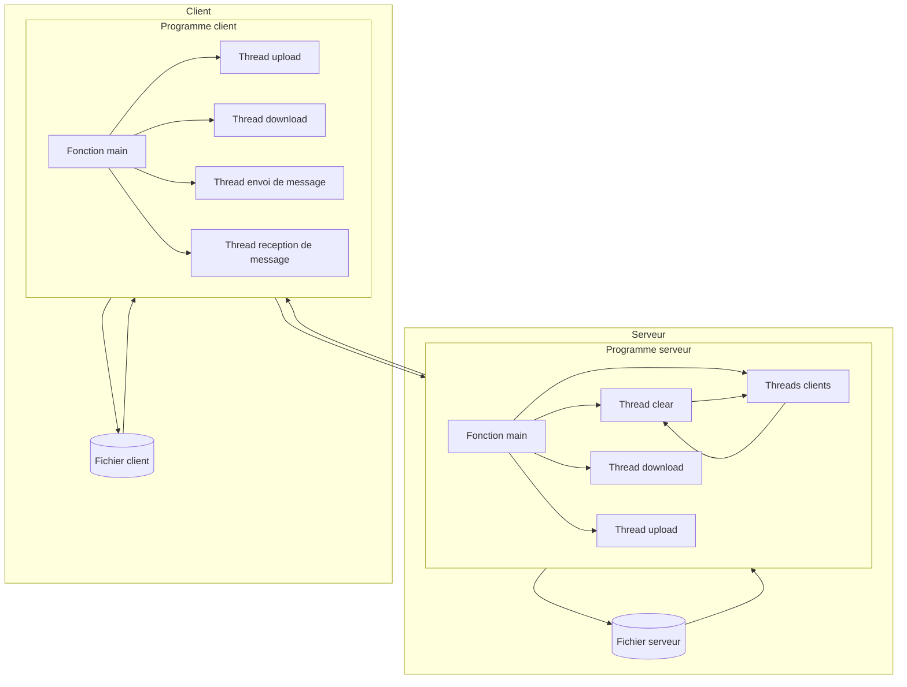

# Livrable du sprint 4

## Nouveautées

Dans ce sprint, nous avons implémenté des salons de discussion: après s'être connecté au serveur, un client peut créer un salon de discussion. 
Maintenant, un client peut se connecter en tant que "superadmin" s'il connait le password secret. Ceci se fait une fois connecté au serveur. Les superadmins peuvent modifier et effacer des salons en plus de toutes les autres commandes.
Ajout de nouvelles commandes (se référer au fichier commandes.txt pour voir la liste et description des commandes).

## Table des matières

**1. [Description du projet](#description-du-projet)**

  1.1. [commandes.txt](#commandestxt)

  1.2. [commandes.c et commandes.h](#commandesc-et-commandesh)

  1.3. [global.c et global.h](#globalc-et-globalh)
  
  1.4. [client.c](#clientc)

  1.5. [serveur.c](#serveurc)

  1.6. [transferServer et transferClient](#transferserver-et-transferclient)

**2. [Protocole de communication](#protocole-de-communication)**
  
  2.1 [Architecture du projet](#architecture-du-projet)

  2.2. [Explication du diagramme de séquence](#explication-du-diagramme-de-séquence)
  
  2.3. [Extrait de la documentation de mermaid](#extrait-de-la-documentation-de-mermaid)
    
  - [Loop](#loop)
  - [Alt](#alt)
  - [Par](#par)

  2.4. [Rappel](#rappel)
  
  2.5. [Diagramme de séquence](#diagramme-de-séquence)

**3. [Difficultés rencontrées](#difficultés-rencontrées)**

**4. [Répartition du travail](#répartition-du-travail)**

**5. [Compilation et exécution](#compilation-et-exécution)**

  5.1. [Tips](#tips)

  5.2. [Commandes](#commandes)

## Description du projet

### **`commandes.txt`**

Tout d'abord il y a le fichier **`commandes.txt`** qui contient toutes les commandes que l'on peut utiliser dans le programme et qui est utilisé pour la commande help. Il est partagé en deux parties, la première partie contient les commandes qui sont utilisées par le client et la deuxième partie contient les commandes qui sont utilisées par le superadmin.

### **`commandes.c`** et **`commandes.h`**

Pour nous organiser nous avons détaché la partie commande du projet dans un fichier différent qui s'appelle **`commandes.c`** et **`commandes.h`**.
Ils contiennent les différentes commandes explicitées dans le fichier **`commandes.txt`**. Avec des fonctions secondaires qui sont utilisées par les commandes.
Cela permet de mieux organiser le code et de mieux comprendre le fonctionnement du programme et que le fichier **`serveur.c`** soit plus compact. Lors de ce dernier sprint, nous avons ajouté la v3 des salons de discussion (mise à par la sauvegarde des salons de discussion dans un fichier lors de l'arrêt du serveur).

### **`global.c`** et **`global.h`**

Les variables globales sont dans le fichier **`global.c`** et **`global.h`**.
Il y a des variables/constantes qui sont utilisées dans **`client.c`**, **`serveur.c`** et **`commandes.c`** ou que dans **`serveur.c`** et **`commandes.c`**. 
Cela permet de modifier qu'une seule fois une variable globale si on veut changer sa valeur ou cela permet d'avoir des fonctions en commun entre **`client.c`** et **`serveur.c`** comme la fonction **`fileExist()`**. Il y a aussi les structures qui sont utilisées dans **`commandes.c`** et **`serveur.c`**.

### **`client.c`**

Ce fichier contient le code du client. Nous avons ajouté les fonctions, les threads pour l'envoi et la récupération de fichier. Ces commandes nécessitent l'ouverture de 2 nouveaux ports pour le download et upload de fichiers. Par conséquent lorsqu'un client download ou upload un fichier, il ouvre un nouveau socket, connexion et port associé à cette action dans un thread ce qui permet de continuer à utiliser le client et de ne pas bloquer le client puis la connexion se ferme une fois l'action terminée. Sur ce dernier sprint il y a aussi la gestion des insultes (remplacement des insultes par des étoiles) qui se trouve dans le fichier **`insultes.txt`**.

### **`serveur.c`**

Ce fichier contient le code du serveur.
Nous avons ajouté les fonctions, les threads pour l'envoi et la récupération de fichier. Ils sont sensiblement les mêmes que ceux du client mais inversés. Lorsque le serveur démarre il écoute sur 2 nouveaux ports qui sont les 2 suivantes du port classique du serveur qui est passé en paramètre. Lors de ce dernier sprint, nous avons controlé sur les commandes qui nécessitent le rôle superadmin.

### **`transferServer`** et **`transferClient`**

Ce sont des dossiers qui contiennent les fichiers qui sont envoyés et reçus par le serveur et le client. Dans la réalité, ils seraient dans un dossier différent car le serveur et le client ne sont pas sur la même machine d'ailleurs il y aurait plusieurs clients avec donc plusieurs dossiers différents de **`transferClient`**. C'est pour cela que lorsque le client download un fichier, il est download pour tous les clients puisque tous les clients sont sur le même dossier.

Nous avons ajouté quelques fichiers d'exemple dans **`transferServer`** et dans **`transferClient`**.

## Protocole de communication

Le diagramme de l'architecture ci-dessous explique le fonctionnement du serveur et des clients, avant de rentrer dans les détails avec le diagramme de séquence.

### Architecture du projet

### Explication du diagramme de séquence

Le diagramme de séquence ci-dessous explique le fonctionnement du serveur et des clients.

Voici les 3 propriétés pour comprendre le diagramme de séquence:

                (Ici x et ClientLambda sont des éléments, Clients et AutresClients sont des ensembles)

                ∀ x ∈ Client, x est un ClientLambda

                Clients = {ClientLambda} ∪ AutresClients

                0 <= |Clients| <= 10 (nombre de clients maximum dans la variable globale)

### Extrait de la documentation de mermaid

#### Loop

        It is possible to express loops in a sequence diagram. This is done by the notation

        loop Loop text
        ... statements ...
        end

#### Alt

        It is possible to express alternative paths in a sequence diagram. This is done by the notation

        alt Describing text
        ... statements ...
        else
        ... statements ...
        end
        
        or if there is sequence that is optional (if without else).

        opt Describing text
        ... statements ...
        end

#### Par

        It is possible to show actions that are happening in parallel. This is done by the notation

        par [Action 1]
        ... statements ...
        and [Action 2]
        ... statements ...
        and [Action N]
        ... statements ...
        end

### Rappel

Pour afficher les différents diagrammes de séquence, **il faut installer l'extension mermaid pour visual studio code**. Si vous vous trouvez sur github, affichage est directement géré par celui-ci.

### Diagramme de séquence

```mermaid
sequenceDiagram
    participant Serveur
    box L'ensemble des clients
        participant ClientLambda
        participant AutresClients
    end
    
    activate Serveur
    Serveur->>Serveur: Initialisation des différentes variables, mutex, sémaphores, mémoire partagée
    Serveur->>Serveur: Ecoute sur les différents ports (port principal, port download, port upload)
    
    activate ClientLambda
    ClientLambda->>ClientLambda: Initialisation
    ClientLambda->>Serveur: Connexion au serveur

    loop Tant que le client lambda est connecté

        par Mise en place de la connexion d'un client lambda
            ClientLambda->>ClientLambda: Lancements des threads de réception et d'envoi
            Serveur-->>ClientLambda: Demande de pseudo
            ClientLambda->>Serveur: Envoi du pseudo
            Serveur->>Serveur: Mise à jour du pseudo
            Serveur-->>ClientLambda: Message de bienvenue + Message du salon général
        and
            Serveur->>Serveur: Mise à jour du tableau de sockets
            Serveur->>Serveur: Lancement du thread qui gère la réception et l'envoi des messages du client lambda
        end

        ClientLambda->>ClientLambda: Entre un message
        ClientLambda->>ClientLambda: Vérification du message (Si le message est trop long ou si le message contient des insultes)

        activate AutresClients

        alt Si le message est une commande (hors sudo upload et sudo download)

            ClientLambda->>Serveur: Envoi d'un message
            Serveur->>Serveur: Vérification du message
            Serveur->>Serveur: Découpage du message en token
            Serveur->>Serveur: Vérification de la commande
            Serveur->>Serveur: Exécution de la commande
            Serveur->>Serveur: Vérifie l'existence de des clients en jeu dans la commande

            alt Si la commande nécessite d'être un admin
                Serveur->>Serveur: Vérifie si le destinataire est un superadmin
            end
            alt Si la commande est sudo create <salon>
                Serveur->>Serveur: Vérifie si le salon existe déjà
                Serveur->>Serveur: Création du salon
                Serveur->>Serveur: Appelle la fonction sudo join <salon>
            else Si la commande est un sudo join <salon>
                Serveur->>Serveur: Vérifie si le salon n'existe pas
                Serveur->>Serveur: Vérifie si le salon est plein
                Serveur->>Serveur: Vérifie si le client lambda est déjà dans le salon
                Serveur->>Serveur: Met à jour le client lambda
            else Si la commande est un sudo leave
                Serveur->>Serveur: Met à jour le client lambda
            else Si la commande est un sudo move <salon> <pseudo>
                Serveur->>Serveur: Vérifie si le salon n'existe pas
                Serveur->>Serveur: Vérifie si le client lambda est déjà dans le salon
                Serveur->>Serveur: Appelle la fonction sudo join <salon>
            else Si la commande est sudo delete <salon>
                Serveur->>Serveur: Vérifie si le salon existe
                Serveur->>Serveur: Vérifie si ce n'est pas le salon général
                Serveur->>Serveur: Supprime le salon
                Serveur->>Serveur: Appelle la fonction ~sudo leave
            else Si la commande est sudo modify <place> <description>
                Serveur->>Serveur: Vérifie si la place est valide
                Serveur->>Serveur: Vérifie si la description est valide
                Serveur->>Serveur: Vérifie si ce n'est pas le salon général
                Serveur->>Serveur: Modifie la place et la description
            else Si la commande est basique
                Serveur->>Serveur: Effectue la commande
            end

            Serveur-->>ClientLambda: Envoi une information sur le résultat de la commande

            opt Si il affecte des autres clients
                Serveur-->>AutresClients: Envoi une information sur le résultat de la commande
                Serveur-->>AutresClients: (opt) Change l'état des clients
            end

        else Si la commande est un sudo upload
            ClientLambda->>ClientLambda: Connexion au serveur sur le port upload
            ClientLambda->>ClientLambda: Choix du fichier à envoyer
            ClientLambda->>Serveur: Envoi du nom du ficher, de la taille du fichier et le contenu du fichier
            Serveur->>Serveur: Vérification du nom du fichier (si le fichier existe déjà alors modification du nom)
            Serveur->>Serveur: Création du fichier, écriture du contenu du fichier
            Serveur-->>ClientLambda: Envoi d'un message de succès
            ClientLambda->>ClientLambda: Déconnexion du serveur sur le port upload
        else Si la commande est un sudo download
            ClientLambda->>ClientLambda: Connexion au serveur sur le port download
            ClientLambda->>Serveur: Demande la liste des fichiers disponibles
            Serveur-->>ClientLambda: Envoi de la liste des fichiers disponibles
            ClientLambda->>ClientLambda: Choix du fichier à télécharger
            ClientLambda->>Serveur: Envoi du nom du fichier
            Serveur-->>ClientLambda: Envoi la taille du fichier et le contenu du fichier
            ClientLambda->>ClientLambda: Déconnexion du serveur sur le port download
        else Si le message est un message normal
            ClientLambda->>Serveur: Envoi d'un message
            Serveur->>Serveur: Vérification du message
            Serveur-->>AutresClients: Diffusion du message aux autres clients (broadcast)
        end

        deactivate AutresClients

        break Le client lambda est déconnecté (avec la commande sudo quit/kick ou ctrl+c)
            Serveur-->>ClientLambda: Préviens le destinataire qu'il va être déconnecté
            ClientLambda->>Serveur: Déconnexion du client lambda
            Serveur->>Serveur: Suppression de la connexion du client lambda
            Serveur->>Serveur: Ajout d'un jeton dans le sémaphore qui gère le nombre de connexion
            Serveur->>Serveur: Nettoyage du thread du client lambda dans la mémoire partagée
        end

    end

    Serveur->>Serveur: Deconnexion des clients
    ClientLambda-->>ClientLambda: Déclenchement un message de fermeture de connexion
    deactivate ClientLambda
    Serveur-->>Serveur: Fermeture du serveur
    deactivate Serveur
```

## Difficultés rencontrées

Maintenant que les plus gros examens sont passés, nous avons le temps de se concentrer sur les projets en vue de la soutenance. Ayant jusqu'à la soutenance pour effectuer toutes les modifications que l'on veut, la pression de respecter un délai est moins lourde vu que les fonctionnalités essentielles ont été implémentées dans les sprints précédents.

Ainsi pour ce sprint, la seule difficulté a été de comprendre comment l'implémentation de salons de discussion devait se faire. La seule difficultée a été de savoir comment implémenter la struct salon. Une fois que nous avons compris comment faire, le reste s'est fait naturellement.

## Répartition du travail

Tout d'abord avant de coder, nous avons décidé en amont comment chaque étape clé devrait être traitée pour donner des indications claires à chacun de nous. Vu que le travail en parallèle a bien fonctionné tout au long du projet, donc nous sommes restés sur la même optique. Puis la répartition du travail s'est faite de manière à pouvoir travailler continuellement en parallèle afin de finir le code le plus tot possible pour bien préparer la soutenance. Pour cette partie, nous sommes directement passés à la v3.

Pour ce sprint Wayne est resté sur la partie client et Léon sur la partie serveur. Wayne s'est occupé de la censure de messages d'insultes ainsi que l'implémentation des nouvelles commandes. 
Léon s'est occupé de la création des salons ainsi que les commandes concernant le salon: modifier, supprimer, move, role admin.

Il a été primordial de travailler l'un a coté de l'autre pour ne pas avoir de blocage et avancer plus rapidement. Une fois que le code a été fait, nous avons fait des test chacun de notre coté pour vérifier qu'il n'y ait aucun problème.

v3 : Le serveur donne la possibilité à un client de créer, modifier et supprimer une chaîne de discussion. (Léon)
Commande permettant de savoir qui est présent sur le serveur et dans les salons (Léon)
Commande permettant de déplacer quelqu’un vers un salon (Léon)
Bonus mettre en place un mots de passe admin pour exécuter des commandes spéciales (kick, stop, delete, move, modify) (Léon)
Commande permettant d’envoyer un message dans tous les salons (Léon)

Censure message (ex :  suppression des insultes) (Wayne)
Commande ff qui supprime tous les fichiers du sprint 4 (Wayne)
Commande permettant de déconnecter un client en particulier (Wayne)
Gestion propre du signal d’interruption (Ctrl+C) (Wayne)

## Compilation et exécution

### Tips

1. Port du serveur doit être supérieur à 1024 pour éviter certains problèmes

2. Pour lancer le serveur, il faut utiliser un autre port + 3 indices (donc si le lancement 1 utilise le port 5000, le port 5000 sera dédié pour le serveur, le port 5001 pour le download, et le port 5002 pour l'upload, donc le lancement 2 doit utiliser le port 5003) pour chaque lancement de serveur car cela peut créer des problèmes avec l'ouverture du socket dédié au fichier.

3. Pour lancer les clients, il faut que le port du client et du serveur soit le même

4. Pour lancer le client, il faut que le serveur soit lancé avant le client

5. En local, l'adresse IP du serveur est 127.0.0.1

6. Possibilité de changer certaines valeurs comme le nombre de clients maximum, le nombre de caractères maximum par message, etc ... dans le fichier **`global.h`**.

### Commandes

1. D'abord compiler le fichier serveur pour avoir un fichier C compilable: 
        
        gcc global.c commandes.c serveur.c -Wall -o serveur

2. Ensuite lancer le serveur: 
        
        ./serveur <port du serveur choisi>  

3. Puis compiler le fichier client: 

        gcc global.c client.c -Wall -o client

4. Enfin pour lancer le client: 

        ./client <adresse IP du serveur> <port du serveur>
